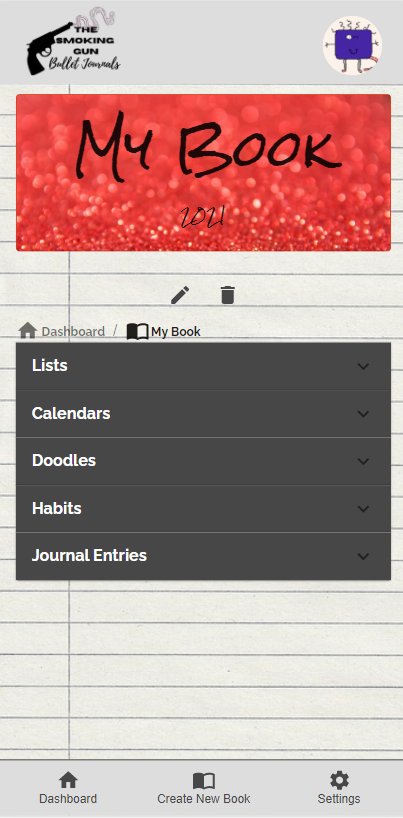

# The Smoking Gun
## Bullet Journals

The Smoking Gun Bullet Journals shot up what normally is a stationary activity and brought bullet journaling to the web. This app is a task manager, sketchbook, journal, idea catcher, and much more!

## [View the Live Page](https://the-smoking-gun.herokuapp.com/)

## Table of Contents

1. [Usage](#Usage)
1. [Languages and Concepts](#Languages-and-Concepts)
1. [Demo](#Demo)
1. [Roadmap](#Roadmap)
1. [Links](#Links)
1. [Contact](#Contact)
1. [Contributing](#Contributing)
1. [License](#License)

## Usage

This bullet journal is a customizable application where you can store different kinds of information all in one place. The ease of use and mobile friendly view of this application will allow you to stay organized both at home and on the go. It's easy to add, edit and delete lists, keep track of daily habits, manage your calendar, throw your thoughts into the journal or take some time to yourself and doodle away with the ability to save or download your own doodles.

## Languages and Concepts

- [React.js](https://reactjs.org/)
- [React Router](https://reactrouter.com/)
- [MongoDB](https://www.mongodb.com/)
- [Mongoose](https://mongoosejs.com/)
- [Express](https://expressjs.com/)
- [Axios](https://www.npmjs.com/package/axios)
- [Material UI](https://material-ui.com/)
- [Firebase](https://firebase.google.com/)
- [FullCalendar](https://fullcalendar.io/)
- [Chart.js](https://www.chartjs.org/)
- [Geolocation NPM](https://www.npmjs.com/package/geolocation)
- [Gravatar](https://en.gravatar.com/)
- [New York Times API](https://developer.nytimes.com/)
- [Weather API](https://www.weatherapi.com/)
- [Random Word API](https://github.com/mcnaveen/Random-Words-API)

## Demo

# Lists

# Calendars

# Doodles

# Habits

# Journal

## Roadmap

To continue with this project, we would like to add the ability for users to add friends, share and collaborate on lists/calendars/etc and possibly have a chat form and blog form to share with other users/public. We would like to add a budget tracker to keep track of income and expenses. We would like to add an edit feature to the doodles and a delete modal so the user has a chance to change their mind. We would like to add themed templates for higher level of customization. We would like to add reminders to the events in the calendars, connect the weather app to the calendar, and connect the calendar to the dashboard to show upcoming events/reminders. We would like to add offline functionality so the app can be used anywhere. We would also like to look into React-Redux and to reduce the amount of code/repetitive code.

## Links

- [See it live](https://the-smoking-gun.herokuapp.com/)
- [Project Repository](https://github.com/UWB-Bandits/the-smoking-gun)

## Contact

- Aubrey Heim - [@aubrey-heim](https://github.com/aubrey-heim)
- Ken Kopelson - [@Kopelson](https://github.com/Kopelson)
- Nicole Marshall - [@ncmarsh](https://github.com/ncmarsh)
- Brandon VanAllen - [@BrandonVA](https://github.com/BrandonVA)

## Contributing

This is a personal project; no contributions are required at this time.

## License

No license granted.

##### [Return to Top of Page](#The-Smoking-Gun)